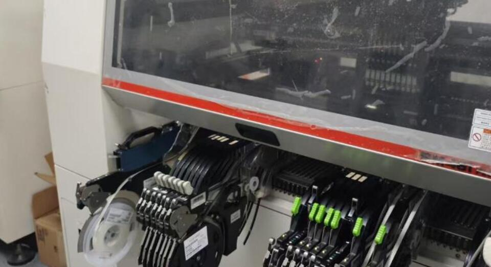

# A Letter to Our Customers

* [中文版](./README_CN.md)

Based on our experience, you may be visiting us due to an interest in smart hardware startups, looking for new business opportunities, or hoping to improve existing products. Whatever your goal is, you've come to the right place. We specialize in helping customers start from scratch and gradually achieve their ideal smart hardware products. We have developed an effective approach to get you started quickly. In short, we have integrated as many functions as possible into a single product and provide a matching cloud processing system. More importantly, we open-source the entire product design and system code so that you can gain a deep understanding and make customized adjustments according to your needs. This way, you can quickly launch projects based on our solutions and tailor them to meet your specific requirements.

## End-to-End Service Capability

We are capable of providing end-to-end custom hardware R&D and production services. Just tell us your needs, and we can offer a one-stop solution including PCB design, embedded firmware development, cloud system and app development, casing design, injection molding, manual and packaging design and production services, as well as agency services for required product certifications. Additionally, we own four SMT assembly lines, providing comprehensive production support from prototyping to mass production, ensuring efficiency and high-quality completion at every stage.

<table>
  <tr>
    <td></td>
    <td></td>
  </tr>
</table>

## Core Team

Our core team members graduated from top universities. Since 2015, despite numerous challenges, we have successfully served many domestic and international clients. With over a decade of technical accumulation, we have explored and established a set of effective strategies to promote customer growth and development. In the following sections, we will introduce these experiences and case studies in detail.

## Contact Information

For more information or inquiries, please contact us at market@zhiyince.com.