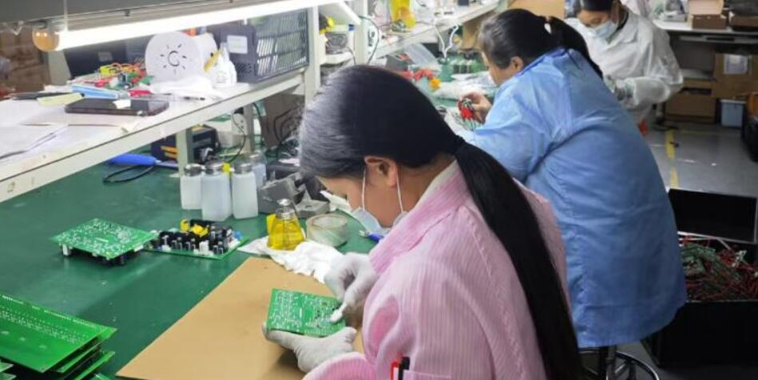

# 致客户的一封信

基于我们的经验，您访问我们可能是出于对智能硬件创业的兴趣、寻找新的商业机会或希望完善现有的产品。无论您的目标是什么，您这次找对地方了。我们专注于帮助客户从零开始，逐步实现他们理想的智能硬件产品。我们摸索出一套行之有效的办法快速帮您上手，简而言之，我们已经将尽可能多的功能集成到单一的产品中，并提供配套的云端处理系统。更重要的是，我们会将整个产品设计及系统的源代码开放给您，以便您能够深入了解并根据自身需求进行定制化调整。通过这种方式，您可以基于我们的解决方案快速启动项目，并在此基础上裁剪出符合您具体需求的产品。

## 端到端服务能力

能够为客户提供端到端的硬件定制研发和生产服务。客户只需提出需求，我们就能提供包括PCB设计、嵌入式固件研发、云端系统和APP研发、外壳设计、注塑开模、说明书和包装设计生产服务，以及代理所需产品认证在内的一站式解决方案。同时，我们拥有四条SMT贴片生产线，可以为客户提供从打样到量产的全面生产支持，确保每个阶段都能高效、高质量地完成。

<table>
  <tr>
    <td></td>
    <td></td>
  </tr>
</table>

## 核心团队

我们的核心团队成员均毕业于中国顶尖学府——复旦大学和上海交通大学。自2015年以来，尽管面临诸多挑战，我们依然成功地为众多国内外客户提供了服务。基于十余年的技术积累，我们探索并制定了一套行之有效的方案，助力客户的成长与发展。接下来，我们将详细介绍这些经验和案例。

## 联系方式

如需更多信息或咨询，请联系market@zhiyince.com。